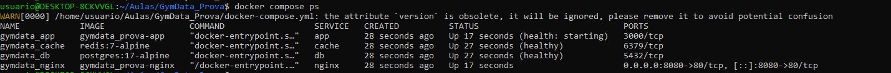
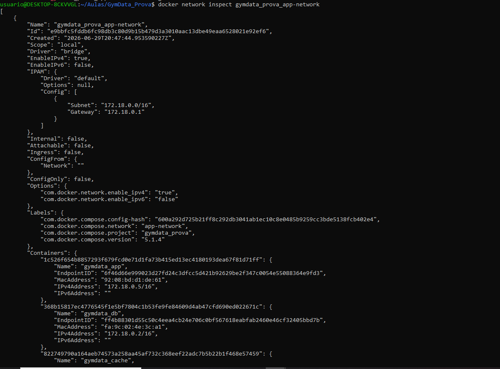
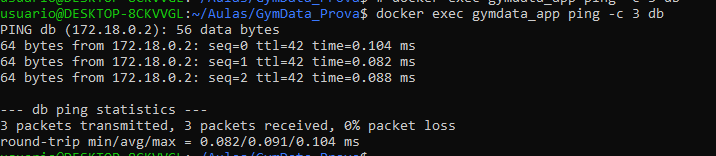
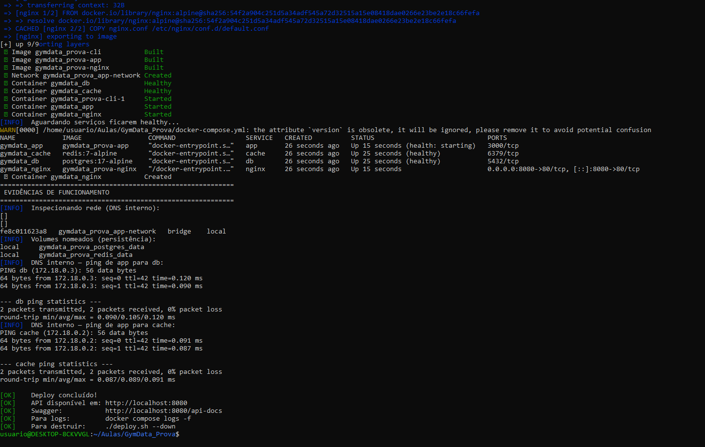
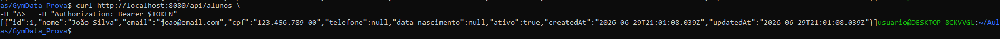
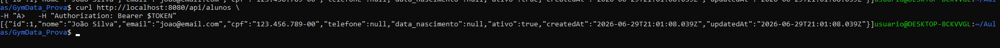
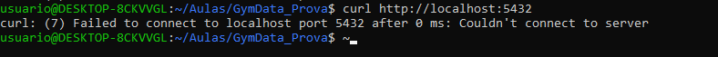
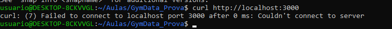

## Prints - Prova de Infraestrutura

# docker compose ps

# docker network inspect gymdata_prova_app-network

# docker exec gymdata_app ping -c 3 db

# chmod +x deploy.sh
# ./deploy.sh --skip-ecr

# Persistência — ANTES do restart
# curl http://localhost:8080/api/alunos -H "Authorization: Bearer $TOKEN"

# docker compose restart db

# Persistência — DEPOIS do restart (dados ainda lá)
# curl http://localhost:8080/api/alunos -H "Authorization: Bearer $TOKEN"

# Segurança — banco inacessível pelo host (deve dar erro)
# curl http://localhost:5432

# Segurança — Node inacessível direto (deve dar erro)
# curl http://localhost:3000
